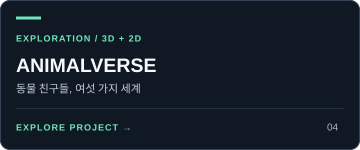

# animal-hood-girl-vtuber

<!-- PROJECT-LINKS:START -->
## 3D Playground

게임·공간·아바타를 한곳에서. 카드를 누르면 저장소로, 아래 버튼을 누르면 공개 데모 또는 실행 안내로 이동합니다.

<table>
<tr>
<td width="50%" valign="top">
<a href="https://github.com/minwoo19930301/seoul-flight-game"></a><br>
<a href="https://minwoo19930301.github.io/seoul-flight-game/"></a>
<a href="https://github.com/minwoo19930301/seoul-flight-game/pulls"></a><br>
<sub>공개 데모는 이전 중심부 · 서울 25구 확장은 최신 PR</sub><br>
<sub><a href="https://github.com/minwoo19930301/seoul-flight-game">저장소</a> · <a href="https://github.com/minwoo19930301/seoul-flight-game/pull/1">병합된 개선 PR #1</a></sub>
</td>
<td width="50%" valign="top">
<a href="https://github.com/minwoo19930301/parking-master-webasm"></a><br>
<a href="https://parking-master-webasm.vercel.app/"></a>
<a href="https://github.com/minwoo19930301/parking-master-webasm/pulls"></a><br>
<sub>공개 데모는 이전 버전 · 최신 소스는 저장소</sub><br>
<sub><a href="https://github.com/minwoo19930301/parking-master-webasm">저장소</a> · <a href="https://github.com/minwoo19930301/parking-master-webasm/pull/2">병합된 개선 PR #2</a></sub>
</td>
</tr>
<tr>
<td width="50%" valign="top">
<a href="https://github.com/minwoo19930301/interior3d"></a><br>
<a href="https://minwoo19930301.github.io/interior3d/"></a>
<a href="https://github.com/minwoo19930301/interior3d/pulls"></a><br>
<sub>공개 데모는 이전 버전 · 19종 모델은 최신 소스</sub><br>
<sub><a href="https://github.com/minwoo19930301/interior3d">저장소</a> · <a href="https://github.com/minwoo19930301/interior3d/pull/1">병합된 개선 PR #1</a></sub>
</td>
<td width="50%" valign="top">
<a href="https://github.com/minwoo19930301/animal-metaverse"></a><br>
<a href="https://minwoo19930301.github.io/animal-metaverse/"></a>
<a href="https://github.com/minwoo19930301/animal-metaverse/pulls"></a><br>
<sub>3D 3종 + 2D 3종 · 아래에서 바로 선택</sub><br>
<sub><a href="https://github.com/minwoo19930301/animal-metaverse">저장소</a> · <a href="https://github.com/minwoo19930301/animal-metaverse/pull/1">병합된 개선 PR #1</a></sub>
</td>
</tr>
<tr>
<td width="50%" valign="top">
<a href="https://github.com/minwoo19930301/flamingo-chess"></a><br>
<a href="https://minwoo19930301.github.io/flamingo-chess/"></a>
<a href="https://github.com/minwoo19930301/flamingo-chess/pulls"></a><br>
<sub>플라밍고 vs 흑조 · AI 대국</sub><br>
<sub><a href="https://github.com/minwoo19930301/flamingo-chess">저장소</a> · <a href="https://github.com/minwoo19930301/flamingo-chess/pull/1">병합된 개선 PR #1</a></sub>
</td>
<td width="50%" valign="top">
<a href="https://github.com/minwoo19930301/animal-hood-girl-vtuber"></a><br>
<a href="https://github.com/minwoo19930301/animal-hood-girl-vtuber#실행"></a>
<a href="https://github.com/minwoo19930301/animal-hood-girl-vtuber/pulls"></a><br>
<sub>macOS 로컬 앱 · 웹 플레이 링크 없음</sub><br>
<sub><a href="https://github.com/minwoo19930301/animal-hood-girl-vtuber">저장소</a> · <a href="https://github.com/minwoo19930301/animal-hood-girl-vtuber/pull/1">병합된 개선 PR #1</a></sub>
</td>
</tr>
<tr>
<td width="50%" valign="top">
<a href="https://github.com/minwoo19930301/flamingo-arcade-2"></a><br>
<a href="https://github.com/minwoo19930301/flamingo-arcade-2#로컬에서-실행"></a>
<a href="https://github.com/minwoo19930301/flamingo-arcade-2"></a><br>
<sub>2D 패러디 8종 + 로우폴리 3D 대전 · 코드만 공개, 미배포</sub>
</td>
<td width="50%" valign="top">
<h3>두 번째 플라밍고 게임 서랍</h3>
<p>라면 · 부적 · 전대 · 철거 · 가상 바탕화면 · 폐차 · 흑백 격투 · 로켓슛 · 장외 대전</p>
<a href="https://github.com/minwoo19930301/flamingo-arcade-2#카트리지-서랍"></a>
<a href="https://github.com/minwoo19930301/flamingo-arcade-2/blob/main/docs/visual-references.md"></a>
</td>
</tr>
</table>

### ANIMALVERSE · 여섯 세계 바로가기

<p>
<a href="https://minwoo19930301.github.io/animal-metaverse/versions/3d/"></a>
<a href="https://minwoo19930301.github.io/animal-metaverse/versions/3d-r3f/"></a>
<a href="https://minwoo19930301.github.io/animal-metaverse/versions/3d-babylon/"></a>
<a href="https://minwoo19930301.github.io/animal-metaverse/versions/2d-pixel/"></a>
<a href="https://minwoo19930301.github.io/animal-metaverse/versions/2d-pastel/"></a>
<a href="https://minwoo19930301.github.io/animal-metaverse/versions/2d-iso/"></a>
</p>

<sub>2026-09-07 확인: 공개 데모 5곳과 ANIMALVERSE 세부 경로 6곳은 HTTP 응답 확인. 화면·조작 검증을 뜻하지 않습니다. 위 개선 PR 6개는 병합됐습니다. Interior3D 공개 데모는 이전 배포이며, Driving Practice 공개 데모의 최신 확장 반영도 확인되지 않았습니다. “최신 PR”에는 병합 전 변경이 포함될 수 있습니다.</sub>

<!-- PROJECT-LINKS:END -->

macOS 화면 위에 떠 있는, 카메라로 움직이는 3D 동물 후드 VTuber 아바타. 눈매·얼굴형·헤어·
헤드기어·의상이 서로 다른 캐릭터 13종 + 원본 플라밍고 1종.

카메라 영상은 로컬 MediaPipe 처리에만 쓰고 저장하거나 외부로 보내지 않는다. 클라우드
추론도, API 키도 없다.

## 캐릭터

숫자열 위쪽 키 또는 아바타 칩으로 전환한다.

| | | |
|:---:|:---:|:---:|
| <br>**`1` 곰**<br>처진 눈 · 크림슨 레드 숄더 보브 | <br>**`2` 원숭이**<br>올라간 눈 · 애시브라운 롱 · 꼬불 긴 꼬리 | <br>**`3` 거북이**<br>반개 눈 · 로즈브라운 친 보브 · 등껍질 |
| <br>**`4` 토끼**<br>큰 눈+애교살 · 블론드 숄더랩 | <br>**`5` 여우**<br>폭스아이 · 플래티넘 비대칭 울프컷 · 흰 꼬리끝 | <br>**`6` 판다**<br>순둥 눈 · 밀크티 롱 |
| <br>**`7` 펭귄**<br>직선 윗꺼풀 · 초콜릿 크롭 | <br>**`8` 부엉이**<br>원형 큰 눈 · 그레이애시 롱 | <br>**`9` 고양이**<br>삼각 귀+수염 · 실버애시 · 얇고 긴 꼬리 |
| <br>**`[` 강아지**<br>순한 둥근 눈 · 접힌 귀+탄 마킹 · 말린 꼬리 | <br>**`0` 호랑이**<br>캣아이 · 순흑 사이드 비대칭 · 검은 꼬리끝 | <br>**`-` 코끼리**<br>처짐 최대 · 허니브라운 미디엄 |
| <br>**`=` 기린**<br>긴 속눈썹 · 그레이지 레이어드 | <br>**`` ` `` 플라밍고**<br>도너 원본 (파이프라인 미적용) |  |

## 실행

```bash
npm install
npm start
```

Node.js 22.18+가 필요하다 (`npm test`는 Node의 TypeScript 실행 기능을 사용한다).

`npm run dev` 개발 모드 · `npm run typecheck` 타입 검사 · `npm run build` 프로덕션 빌드.
창은 항상 위에 뜨는 투명·클릭통과 오버레이이고, 숨기면 렌더 루프와 웹캠이 함께 멈춘다.
상단 카메라 버튼으로 언제든 카메라를 끄고 자동 모션만 사용할 수 있다. 권한 거부,
연결 해제, 트래커 초기화 실패 시 카메라 스트림을 닫고 `다시 연결` 버튼을 표시한다.
아바타 로드 실패는 별도 메시지와 재시도 버튼으로 표시하며 카메라를 시작하지 않는다.
칩 또는 아바타 우클릭 메뉴에서 캐릭터, 크기, 종료를 선택한다.

`npm test`는 카메라 수명·취소·재시도·권한 정책과 얼굴/헤어 지오메트리를 검사한다.
실제 카메라나 macOS 권한 승인은 사용하지 않는다.

## 아바타 팩

13종 VRM은 도너 하나에서 결정적으로 재생성된다 — 카탈로그와 디자인 모듈이 입력,
`public/models/<slug>.vrm`이 출력이다. 휴머노이드 본과 표정 슬롯은 도너 그대로 보존된다.

```bash
npm run avatars:build     # 카탈로그 → 13 VRM (같은 입력 → 같은 바이트)
npm run avatars:audit     # 리그·표정 보존, 텍스처 규격, 고유성 검사
npm run avatars:shots     # 14종 × 7씬 렌더 QA 행렬
npm run avatars:gifs      # 14종 아이들 루프 GIF
```

`avatars:audit`는 빌드가 만든 `work/avatar-pack`의 텍스처·매니페스트도 대조하므로,
처음 clone한 뒤에는 `avatars:build`를 먼저 실행한다.

차별화는 텍스처 재염색 + 결정적 지오메트리 연산으로 이뤄진다: 얼굴형 워프
(`face-warp.mjs`), 헤어·스커트 길이 클리핑(`hair-trim.mjs`), 헤어핀 형태
(`hairpin-shape.mjs`), 눈매 프로필(`eye-profiles.mjs`). 동물 후드·귀·부리는 앱 쪽
procedural 지오메트리(`src/model/animals/`)다.

상세 문서: [Animal Avatar Pack](docs/ANIMAL-AVATAR-PACK.md) ·
[Avatar Pipeline](docs/AVATAR-PIPELINE.md)

## 크레딧

도너 모델은 pixiv VRoid 공식 샘플 **Sendagaya Shino** (`licenseName: CC0`, 상업 이용·
개변·재배포 허용). 13종 아바타와 후드는 그 모델에서 파생된 결정적 편집 결과물이다.
