# animal-hood-girl-vtuber

macOS 화면 위에 떠 있는, 카메라로 움직이는 3D 동물 후드 VTuber 아바타 앱이다. 같은
탈을 색만 바꾼 팩이 아니라 **눈매·얼굴형·헤어·헤드기어·의상이 서로 다른 인간형 캐릭터
12종**(+ 원본 플라밍고 1종)을 제공한다.

카메라 영상은 로컬 MediaPipe 처리에만 쓰고 저장하거나 외부로 보내지 않는다. 표정,
고개, 팔, 손가락 움직임은 공통 VRM 리그로 전달된다. 클라우드 추론도, API 키도 없다.

## 캐릭터

숫자열 위쪽 키 또는 앱 메뉴에서 전환한다. 마지막 선택은 이 기기의 `localStorage`에만
저장된다.

| | | |
|:---:|:---:|:---:|
| 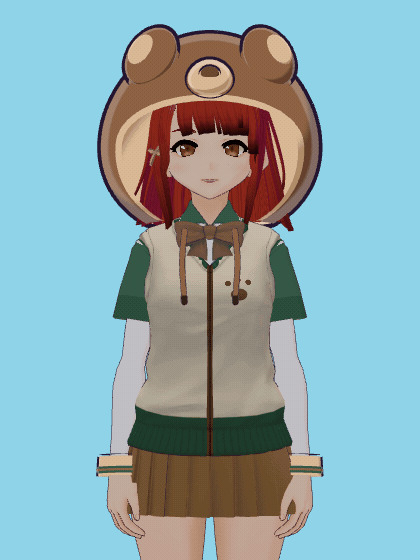<br>**`1` 곰**<br>순한 처진 눈<br>블루블랙 숄더 보브 | 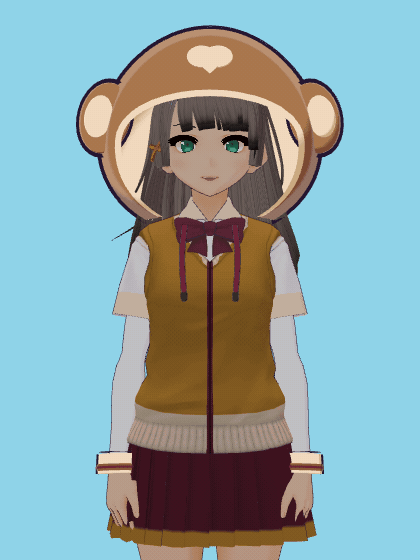<br>**`2` 원숭이**<br>장난기 올라간 눈<br>쿨 애시브라운 하이 포니 | 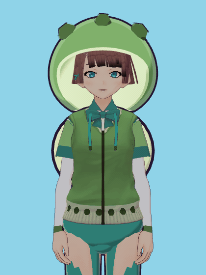<br>**`3` 거북이**<br>나른한 반개 직선 눈<br>로즈 브라운 블런트 보브 |
| 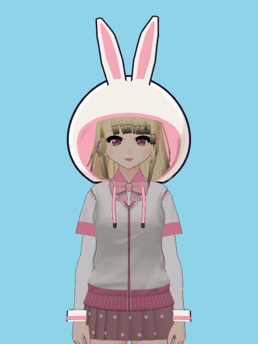<br>**`4` 토끼**<br>세로로 큰 동그란 눈 + 애교살<br>페일 골드 블론드 트윈테일 | 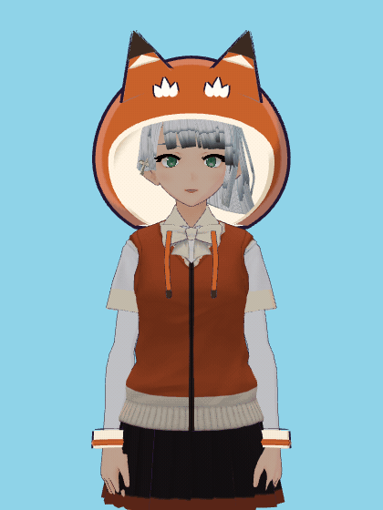<br>**`5` 여우**<br>날카로운 폭스아이<br>플래티넘 실버 울프컷 | 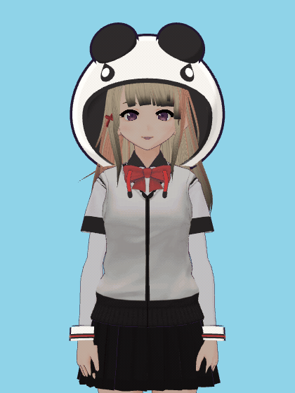<br>**`6` 판다**<br>동글 순둥<br>밀크티 베이지 스페이스 번 |
| 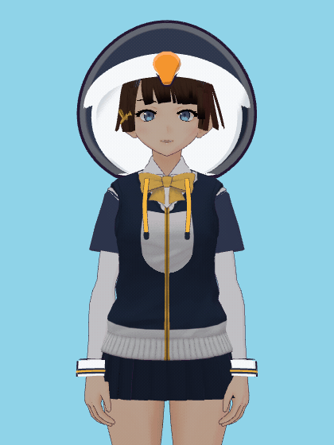<br>**`7` 펭귄**<br>시원한 직선 윗꺼풀<br>초콜릿 브라운 크롭 | 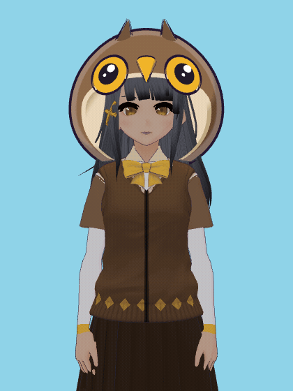<br>**`8` 부엉이**<br>크게 뜬 원형<br>다크 그레이 애시 브레이드 | 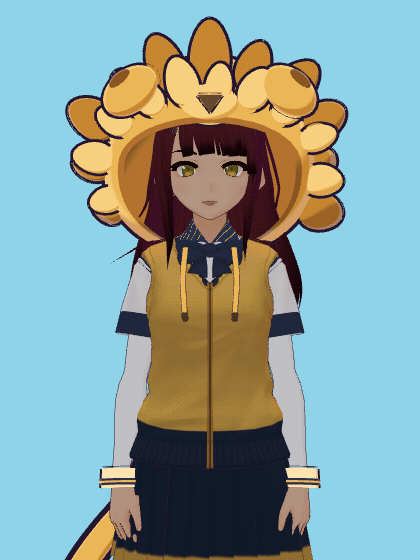<br>**`9` 사자**<br>대담한 굵은 라인<br>다크 버건디 볼륨 메인 |
| 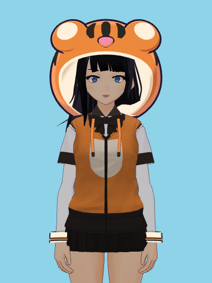<br>**`0` 호랑이**<br>가장 좁은 캣아이<br>순흑 하이 브레이드 포니 | 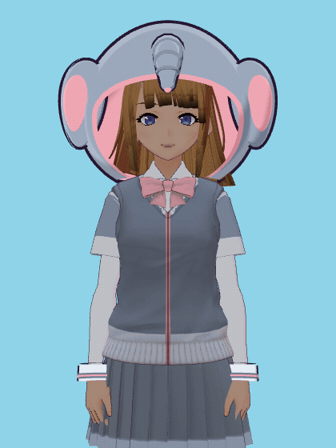<br>**`-` 코끼리**<br>길고 낮은 순한 눈<br>허니 브라운 로우 포니 | 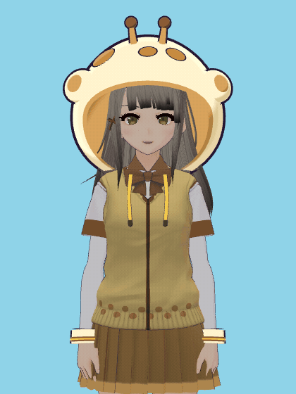<br>**`=` 기린**<br>와이드 아몬드 + 긴 속눈썹<br>그레이지 버블 포니 |
| 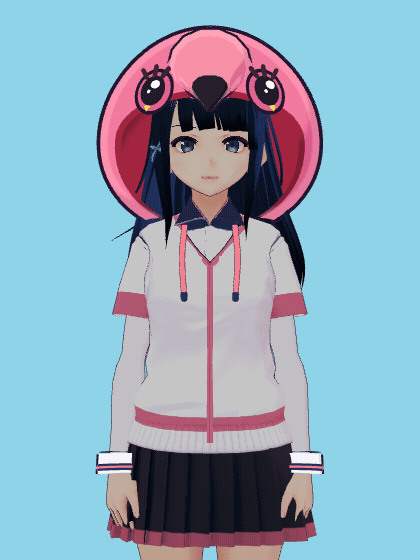<br>**`` ` `` 플라밍고**<br>원본 오서링 모델<br>시노 교복 + 플라밍고 후드 | | |

GIF는 결정적 룩덱 하네스가 렌더한 12프레임 아이들 루프다(`npm run avatars:gifs`).
고개 스웨이·눈깜빡임·발화·호흡 2차 모션이 들어 있고, 실제 앱에서는 이 채널들이 카메라
트래킹으로 구동된다.

## 실행

```bash
npm install
npm start
```

개발 모드는 `npm run dev`, 타입 검사는 `npm run typecheck`, 프로덕션 빌드는
`npm run build`.

창은 항상 위에 뜨는 투명·클릭통과 오버레이다(우측 하단 기본 배치). 트레이 메뉴나
전역 단축키로 숨기고, 숨기면 렌더 루프와 웹캠·MediaPipe가 함께 멈춘다.

## 아바타 팩 파이프라인

12종 VRM은 저장된 바이너리를 손으로 만든 게 아니라, 하나의 도너 모델에서 **결정적으로
재생성**된다. 카탈로그(`shared/avatar-catalog.json`) + 디자인 모듈이 입력이고 출력은
`public/models/<slug>.vrm`다.

```bash
npm run avatars:build     # 카탈로그 → 12 VRM 재생성 (같은 입력 → 같은 바이트)
npm run avatars:audit     # 리그·표정 보존, 텍스처 규격, 모델/홍채/의상 고유성
npm run avatars:shots     # 13종 × 7씬 렌더 QA 행렬
npm run avatars:gifs      # 13종 아이들 루프 GIF (docs/gif/)
node scripts/test-face-warp.mjs   # 얼굴형 워프 자체 검증
node scripts/test-hair-trim.mjs   # 헤어 컷 지오메트리 클리핑 자체 검증
```

편집 범위는 임베드된 알베도/마스크 텍스처, 일부 MToon 머티리얼 색, 그리고 두 가지
결정적 지오메트리 연산뿐이다. 휴머노이드 본(103 joints), 표정 슬롯, 모프타깃은 도너
그대로 보존된다.

- **얼굴형 워프** (`scripts/lib/face-warp.mjs`) — 라운드/샤프/롱소프트/뉴트럴 4계열
  버텍스 성형. 눈알 버텍스는 하드락, 진폭 상한 강제.
- **헤어 길이 컷** (`scripts/lib/hair-trim.mjs`) — 컷 평면 `y = yCut + 지터(x)`로
  헤어 스트랜드를 Sutherland–Hodgman 클리핑.

### 헤어 컷을 텍스처가 아니라 지오메트리에서 하는 이유

초기 구현은 스트랜드 아틀라스(`img25`)의 특정 UV 행 이하를 알파 0으로 지웠다. 그러면
컷 대상 5종의 **이마 중앙에 수평 대시가 남아 '1자 눈썹'처럼 읽히는 버그**가 생겼다.

원인은 아틀라스 공유였다. 실측하면 커버리지 99.2%에, 텍셀 하나가 대응하는 world Y의
폭이 중앙값 0.192 / p90 0.348이다(헤어 전체 높이 0.570의 34~61%). 즉 턱 높이의 롱
스트랜드와 이마를 지나는 베이비헤어가 같은 텍셀을 쓰기 때문에, "행 이하 알파 0"은 둘을
동시에 자른다. 텍스처 공간에서는 분리가 원리적으로 불가능하다.

지금은 컷을 메시에서 수행한다. `yCut`은 하드코딩 좌표가 아니라 기존 컷 행 근처 UV v를
가진 버텍스의 median y에서 유도하고, 이마 위 카드는 평면보다 높아 자동으로 보존된다.
텍스처 편집에는 팁 재음영만 남았다.

## 로컬 전용 계약

- 외부 AI·클라우드 추론 없음, API 키·계정 없음
- 카메라 프레임 저장·업로드 없음, 런타임 네트워크 경로 없음
- 온디바이스 MediaPipe Tasks Vision + three.js/@pixiv/three-vrm 렌더링만 사용

## 크레딧

도너 모델은 pixiv VRoid 공식 샘플 **Sendagaya Shino**(`licenseName: CC0`,
상업 이용·개변·재배포 허용)다. 12종 아바타와 플라밍고 후드는 그 모델에서 파생된
결정적 편집 결과물이다.

파이프라인 상세는 [Animal Avatar Pack](docs/ANIMAL-AVATAR-PACK.md), 새 캐릭터 추가
절차는 [Avatar Pipeline](docs/AVATAR-PIPELINE.md)에 있다.
