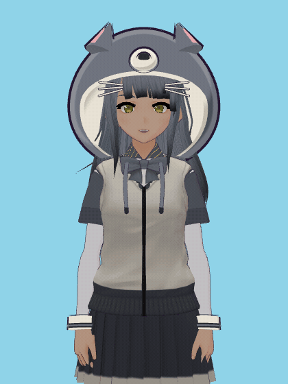
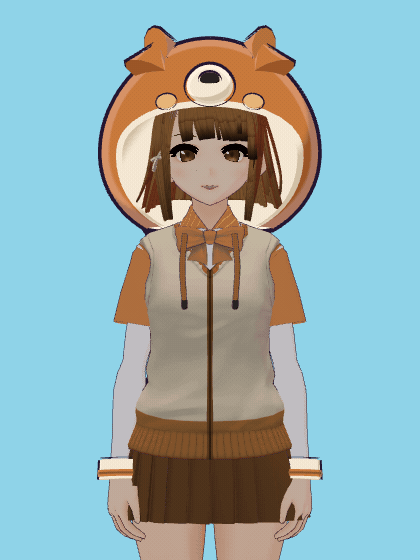

# animal-hood-girl-vtuber

macOS 화면 위에 떠 있는, 카메라로 움직이는 3D 동물 후드 VTuber 아바타. 눈매·얼굴형·헤어·
헤드기어·의상이 서로 다른 캐릭터 13종 + 원본 플라밍고 1종.

카메라 영상은 로컬 MediaPipe 처리에만 쓰고 저장하거나 외부로 보내지 않는다. 클라우드
추론도, API 키도 없다.

## 캐릭터

숫자열 위쪽 키 또는 아바타 칩으로 전환한다.

| | | |
|:---:|:---:|:---:|
| <br>**`1` 곰**<br>처진 눈 · 크림슨 레드 숄더 보브 | <br>**`2` 원숭이**<br>올라간 눈 · 애시브라운 롱 · 꼬불 긴 꼬리 | <br>**`3` 거북이**<br>반개 눈 · 로즈브라운 친 보브 · 등껍질 |
| <br>**`4` 토끼**<br>큰 눈+애교살 · 블론드 숄더랩 | <br>**`5` 여우**<br>폭스아이 · 플래티넘 비대칭 울프컷 · 흰 꼬리끝 | <br>**`6` 판다**<br>순둥 눈 · 밀크티 롱 |
| <br>**`7` 펭귄**<br>직선 윗꺼풀 · 초콜릿 크롭 | <br>**`8` 부엉이**<br>원형 큰 눈 · 그레이애시 롱 | <br>**`9` 고양이**<br>삼각 귀+수염 · 실버애시 · 얇고 긴 꼬리 |
| <br>**`[` 강아지**<br>순한 둥근 눈 · 접힌 귀+탄 마킹 · 말린 꼬리 | <br>**`0` 호랑이**<br>캣아이 · 순흑 사이드 비대칭 · 검은 꼬리끝 | <br>**`-` 코끼리**<br>처짐 최대 · 허니브라운 미디엄 |
| <br>**`=` 기린**<br>긴 속눈썹 · 그레이지 레이어드 | <br>**`` ` `` 플라밍고**<br>도너 원본 (파이프라인 미적용) |  |

## 실행

```bash
npm install
npm start
```

`npm run dev` 개발 모드 · `npm run typecheck` 타입 검사 · `npm run build` 프로덕션 빌드.
창은 항상 위에 뜨는 투명·클릭통과 오버레이이고, 숨기면 렌더 루프와 웹캠이 함께 멈춘다.

## 아바타 팩

13종 VRM은 도너 하나에서 결정적으로 재생성된다 — 카탈로그와 디자인 모듈이 입력,
`public/models/<slug>.vrm`이 출력이다. 휴머노이드 본과 표정 슬롯은 도너 그대로 보존된다.

```bash
npm run avatars:build     # 카탈로그 → 13 VRM (같은 입력 → 같은 바이트)
npm run avatars:audit     # 리그·표정 보존, 텍스처 규격, 고유성 검사
npm run avatars:shots     # 14종 × 7씬 렌더 QA 행렬
npm run avatars:gifs      # 14종 아이들 루프 GIF
```

차별화는 텍스처 재염색 + 결정적 지오메트리 연산으로 이뤄진다: 얼굴형 워프
(`face-warp.mjs`), 헤어·스커트 길이 클리핑(`hair-trim.mjs`), 헤어핀 형태
(`hairpin-shape.mjs`), 눈매 프로필(`eye-profiles.mjs`). 동물 후드·귀·부리는 앱 쪽
procedural 지오메트리(`src/model/animals/`)다.

상세 문서: [Animal Avatar Pack](docs/ANIMAL-AVATAR-PACK.md) ·
[Avatar Pipeline](docs/AVATAR-PIPELINE.md)

## 크레딧

도너 모델은 pixiv VRoid 공식 샘플 **Sendagaya Shino** (`licenseName: CC0`, 상업 이용·
개변·재배포 허용). 13종 아바타와 후드는 그 모델에서 파생된 결정적 편집 결과물이다.
