# animal-hood-girl-vtuber

<!-- PROJECT-PRESENTATION:START -->
<a href="https://github.com/minwoo19930301/animal-hood-girl-vtuber">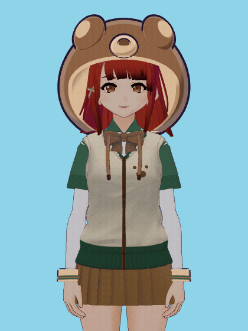</a>

[](#실행) [](https://github.com/minwoo19930301/animal-hood-girl-vtuber)
<!-- PROJECT-PRESENTATION:END -->

macOS와 Windows 화면 위에 떠 있는, 카메라로 움직이는 3D 동물 후드 VTuber 아바타. 눈매·얼굴형·헤어·
헤드기어·의상이 서로 다른 캐릭터 13종 + 원본 플라밍고 1종.

카메라 영상은 로컬 MediaPipe 처리에만 쓰고 저장하거나 외부로 보내지 않는다. 클라우드
추론도, API 키도 없다.

## 캐릭터

⌘+숫자열 키(⌘1~9, ⌘0, ⌘-, ⌘=, ⌘`, ⌘[) 또는 아바타 칩으로 전환한다. Windows에서는 ⌘ 자리에 `Ctrl`을 쓴다(`Ctrl+1` 등). 맨 숫자 키는 리액션이다(아래).

| | | |
|:---:|:---:|:---:|
| <br>**`⌘1` 곰**<br>처진 눈 · 크림슨 레드 숄더 보브 | 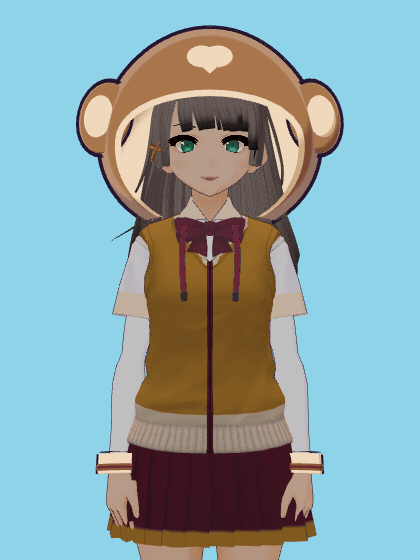<br>**`⌘2` 원숭이**<br>올라간 눈 · 애시브라운 롱 · 꼬불 긴 꼬리 | 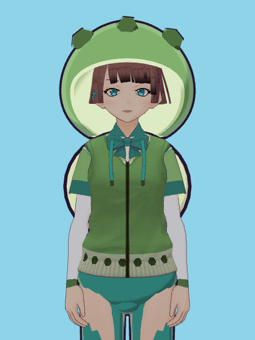<br>**`⌘3` 거북이**<br>반개 눈 · 로즈브라운 친 보브 · 등껍질 |
| 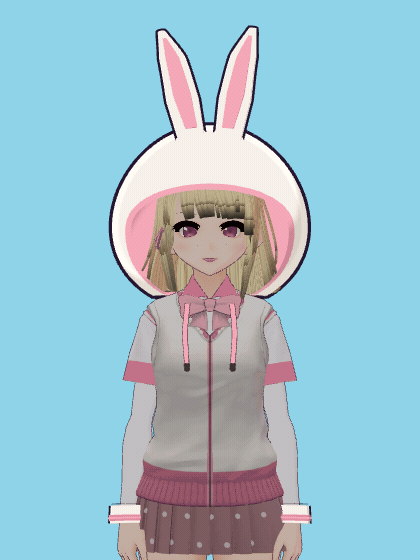<br>**`⌘4` 토끼**<br>큰 눈+애교살 · 블론드 숄더랩 | 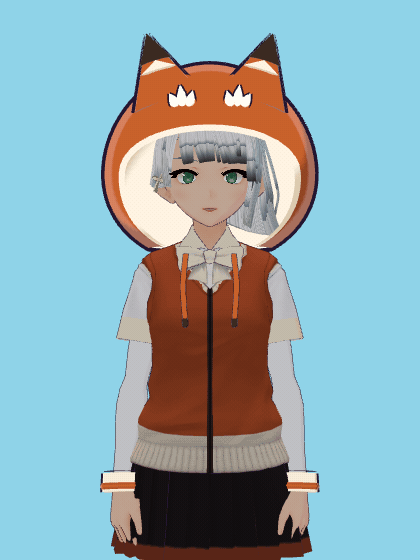<br>**`⌘5` 여우**<br>폭스아이 · 플래티넘 비대칭 울프컷 · 흰 꼬리끝 | 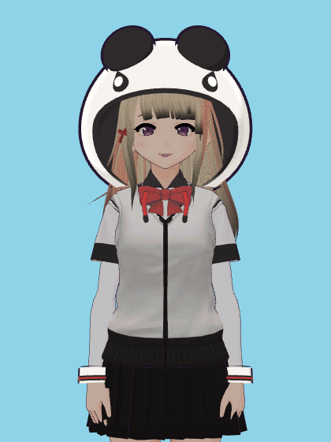<br>**`⌘6` 판다**<br>순둥 눈 · 밀크티 롱 |
| 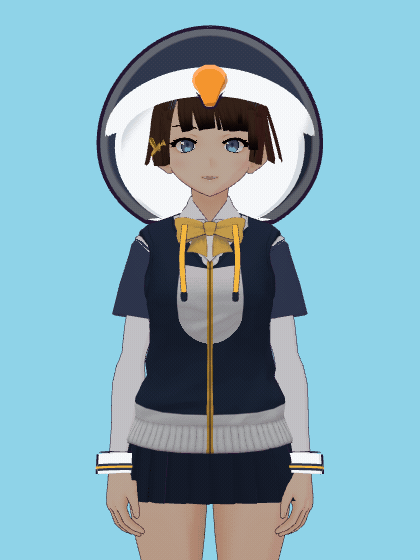<br>**`⌘7` 펭귄**<br>직선 윗꺼풀 · 초콜릿 크롭 | 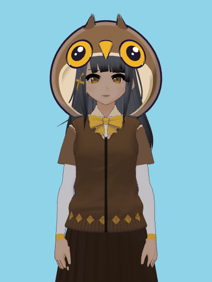<br>**`⌘8` 부엉이**<br>원형 큰 눈 · 그레이애시 롱 | 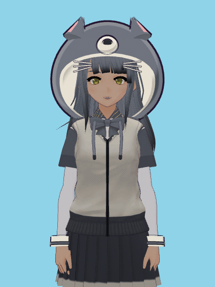<br>**`⌘9` 고양이**<br>삼각 귀+수염 · 실버애시 · 얇고 긴 꼬리 |
| 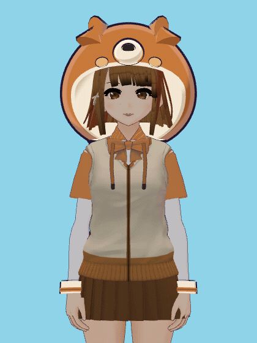<br>**`⌘[` 강아지**<br>순한 둥근 눈 · 접힌 귀+탄 마킹 · 말린 꼬리 | 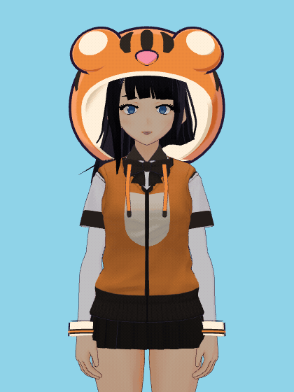<br>**`⌘0` 호랑이**<br>캣아이 · 순흑 사이드 비대칭 · 검은 꼬리끝 | 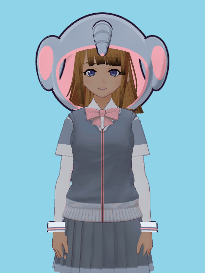<br>**`⌘-` 코끼리**<br>처짐 최대 · 허니브라운 미디엄 |
| 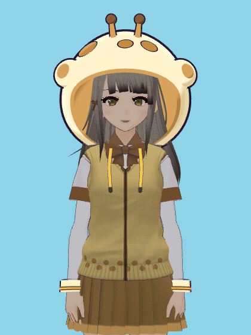<br>**`⌘=` 기린**<br>긴 속눈썹 · 그레이지 레이어드 | 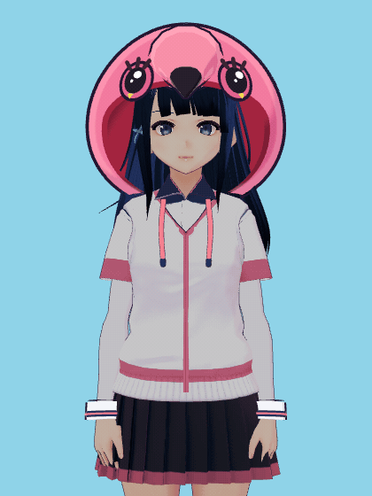<br>**`` ⌘` `` 플라밍고**<br>도너 원본 (파이프라인 미적용) |  |

## 리액션

숫자 키 1~9, 0으로 짧은 연출 10종을 재생한다. 표정, 팔 제스처, 몸·다리 움직임, 떠다니는 이펙트가 한 번에 움직인다. 재생 중에도 트래킹은 계속 살아 있고, 끝나면 부드럽게 넘겨받는다.

| 키 | 리액션 | 내용 |
|:---:|---|---|
| `1` | 기쁨 | 웃는 눈, 깡충깡충, 주먹을 번갈아 펌프, 머리 위 꽃 관과 반짝이 |
| `2` | 슬픔 | 처진 표정, 고개와 어깨가 떨어짐, 한 손씩 번갈아 눈가를 훔침, 눈물방울 |
| `3` | 화남 | 매서운 눈, 가슴 앞 주먹 부들, 발 구르기 세 번, 후드 위 분노 마크와 먼지 |
| `4` | 놀람 | 휘둥그레진 눈, 뒤로 껑충, 손 번쩍, 느낌표와 땀방울 |
| `5` | 사랑 | 하트 눈과 홍조, 가슴 앞 하트 손, 머리 위 하트, 떠오르는 하트 |
| `6` | 인사 | 큰 손인사와 고개 갸웃, 마지막에 두 손을 모으고 꾸벅 |
| `7` | 부끄러움 | 홍조, 시선 회피, 볼을 감싼 두 손, 몸 배배 꼬기 |
| `8` | 축하 | 큰 점프 세 번, 만세, 색종이 폭죽 |
| `9` | 꾸벅 인사 | 약 2.6초. 두 손을 아랫배 앞에 모으고 허리를 약 43° 숙였다 일어남. 눈을 내리깐 차분한 표정, 이펙트 없음. 인사와 사과에 같이 쓴다 |
| `0` | 귀여운 춤 | 약 5초. 볼 손 스웨이, 하트 손, 토 탭, 웅크렸다 점프하며 360° 트월, 윙크와 브이 엔딩 |

- 창에 포커스가 있으면(브라우저 실행 포함) 맨 숫자 키가 바로 먹는다. 꾹 눌러도 한 번만 재생한다.
- 다른 앱을 쓰는 중에도 `Ctrl+Option+1`~`9`, `Ctrl+Option+0`이 먹는다(Windows는 `Ctrl+Alt+숫자`). 오버레이 창은 클릭스루라 평소에는 포커스가 없어서 이 전역 단축키가 주 경로다.
- `Esc`(창 포커스) 또는 `Ctrl+Option+Esc`(전역, Windows는 `Ctrl+Alt+Esc`)로 재생 중인 리액션을 접는다. `Esc`는 캐릭터 피커도 닫는다.
- 메뉴 바와 우클릭 팝업의 `리액션` 메뉴에서도 고를 수 있다.
- 같은 키를 다시 누르면 처음부터 다시, 다른 키를 누르면 교차한다.
- `C`는 캐릭터 피커 토글, 캐릭터 전환은 위의 `⌘`(Windows는 `Ctrl`)+키다.

상세: [리액션 문서](docs/REACTIONS.md)

## 실행

```bash
npm install
npm start
```

Node.js 22.18+가 필요하다 (`npm test`는 Node의 TypeScript 실행 기능을 사용한다).

`npm run dev` 개발 모드 · `npm run typecheck` 타입 검사 · `npm run build` 프로덕션 빌드 · `npm run test:reactions` 리액션 엔진 검증 ·
`npm run pack`(macOS 런처 번들) / `npm run app`(번들을 만들어 실행, macOS 전용) · `npm run pack:win`(Windows 포터블 앱, 아래).
npm 스크립트는 Windows(cmd·PowerShell)에서도 돌도록 `VAR=값` 접두 문법·`npx`·맥 Chrome 경로를 걷어냈다(`avatars:gifs`는 `ffmpeg`이 PATH에 있어야 한다). 헤드리스 스크린샷·QA 스크립트는 Chrome(Windows는 Edge도 가능)을 찾아 쓰고, 다른 위치에 있으면 `CHROME=<실행 파일 경로>`로 알려 준다.
창은 항상 위에 뜨는 투명·클릭통과 오버레이이고, 숨기면 렌더 루프와 웹캠이 함께 멈춘다.
상단 카메라 버튼으로 언제든 카메라를 끄고 자동 모션만 사용할 수 있다. 권한 거부,
연결 해제, 트래커 초기화 실패 시 카메라 스트림을 닫고 `다시 연결` 버튼을 표시한다.
아바타 로드 실패는 별도 메시지와 재시도 버튼으로 표시하며 카메라를 시작하지 않는다.
칩 또는 아바타 우클릭 메뉴에서 캐릭터, 리액션, 크기, 종료를 선택한다.

`npm test`는 카메라 수명·취소·재시도·권한 정책과 얼굴/헤어 지오메트리를 검사한다.
실제 카메라나 OS 권한 승인은 사용하지 않는다.

### Windows

같은 코드가 Windows 10/11에서도 돈다. `npm install` 뒤 `npm start`.

- 단축키: 캐릭터 전환은 `Ctrl`+키(`Ctrl+1` 등), 전역 리액션은 `Ctrl+Alt+숫자`·`Ctrl+Alt+Esc`, 퀵 하이드는 `Ctrl+Shift+M`이다. 화면의 안내 문구도 OS에 맞춰 `Ctrl+`로 바뀐다. AltGr(= Ctrl+Alt)로 글자를 입력하는 자판에서는 전역 리액션이 겹칠 수 있으니 창 포커스의 맨 숫자 키나 메뉴를 쓴다.
- 숨기기: 창에 프레임이 없어 숨기면 작업 표시줄 버튼도 사라진다. 트레이 아이콘을 왼쪽 클릭하면 숨기기/보이기, 오른쪽 클릭하면 메뉴(숨기기/보이기·종료)가 나온다. 칩이나 아바타 우클릭 메뉴는 맥과 같다.
- 카메라: Windows에는 앱별 권한 창이 없고 `설정 > 개인 정보 및 보안 > 카메라`의 전역 스위치(`카메라 액세스`, `데스크톱 앱이 카메라에 액세스하도록 허용`)만 있다. 꺼져 있으면 시작할 때 안내 창이 뜨고 설정을 열어 준다. 시작한 뒤 막히면(다른 앱이 카메라를 쓰는 중이거나 카메라가 없을 때 포함) 상단 상태 줄에 원인별 안내가 나오고 자동 모션으로 계속 동작한다.
- 창: 크기는 고정이고(투명 창은 Windows에서 크기를 조절하면 깨질 수 있다) 아바타 크기는 메뉴의 `아바타 작게/크게`로 맞춘다. 작업 영역이 창보다 낮으면(1080p 배율 150%면 약 680px) 창 높이를 그 안으로 줄인다. 풀스크린 앱 위에 뜨는 것은 macOS 패널 창만 되는 동작이라 Windows에서는 해당하지 않는다.

포터블 앱은 저장소 없이 받아서 쓸 수 있게 만든다.

```bash
npm run pack:win                    # release/Animal Hood VTuber-win32-x64/ + release/Animal-Hood-VTuber-win32-x64.zip
npm run pack:win -- --arch=all      # arm64(Windows on ARM)까지. --arch=arm64 도 가능
npm run pack:win -- --no-zip        # zip 없이 폴더만
npm run pack:win -- --skip-build    # dist/ 를 다시 빌드하지 않고 사용
```

wine 없이 맥·리눅스·Windows 어디서든 만들 수 있다(처음 한 번 GitHub에서 Electron 바이너리를 받는다). 폴더에 `resources/app/`(코드와 `dist/`, `shared/`)이 풀려 있고, VRM 14종이 들어 있어 폴더는 약 690 MB, zip은 약 400 MB다. 받는 쪽은 zip을 풀고 `AnimalHoodVTuber.exe`를 실행하면 된다. 서명하지 않아서 처음 실행하면 SmartScreen이 막는다. `추가 정보` > `실행`을 누른다.

Windows 지원은 macOS에서 작성했고 코드 경로, 단축키 문자열, 패키지 구조까지만 확인했다. 실제 Windows에서 창 투명도·클릭스루·트레이·카메라 권한 안내를 눌러 본 것은 아직 아니다.

## 아바타 팩

13종 VRM은 도너 하나에서 결정적으로 재생성된다 — 카탈로그와 디자인 모듈이 입력,
`public/models/<slug>.vrm`이 출력이다. 휴머노이드 본과 표정 슬롯은 도너 그대로 보존된다.

```bash
npm run avatars:build     # 카탈로그 → 13 VRM (같은 입력 → 같은 바이트)
npm run avatars:audit     # 리그·표정 보존, 텍스처 규격, 고유성 검사
npm run avatars:shots     # 14종 × 7씬 렌더 QA 행렬
npm run avatars:gifs      # 14종 아이들 루프 GIF
```

`avatars:audit`는 빌드가 만든 `work/avatar-pack`의 텍스처·매니페스트도 대조하므로,
처음 clone한 뒤에는 `avatars:build`를 먼저 실행한다.

차별화는 텍스처 재염색 + 결정적 지오메트리 연산으로 이뤄진다: 얼굴형 워프
(`face-warp.mjs`), 헤어·스커트 길이 클리핑(`hair-trim.mjs`), 헤어핀 형태
(`hairpin-shape.mjs`), 눈매 프로필(`eye-profiles.mjs`). 동물 후드·귀·부리는 앱 쪽
procedural 지오메트리(`src/model/animals/`)다.

상세 문서: [Animal Avatar Pack](docs/ANIMAL-AVATAR-PACK.md) ·
[Avatar Pipeline](docs/AVATAR-PIPELINE.md)

## 크레딧

도너 모델은 pixiv VRoid 공식 샘플 **Sendagaya Shino** (`licenseName: CC0`, 상업 이용·
개변·재배포 허용). 13종 아바타와 후드는 그 모델에서 파생된 결정적 편집 결과물이다.
